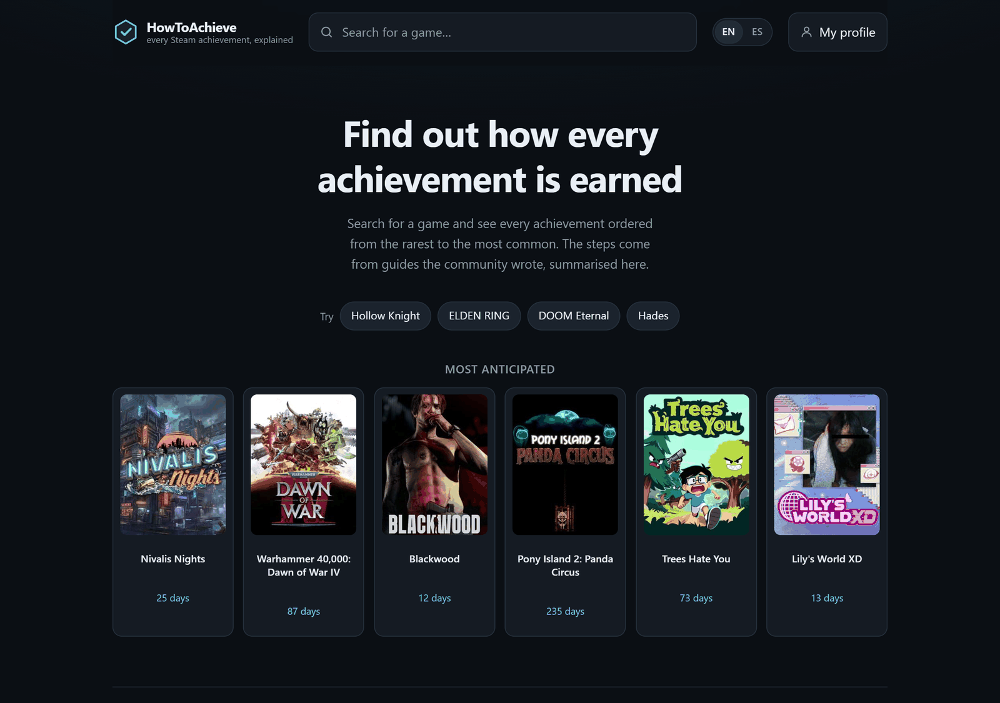
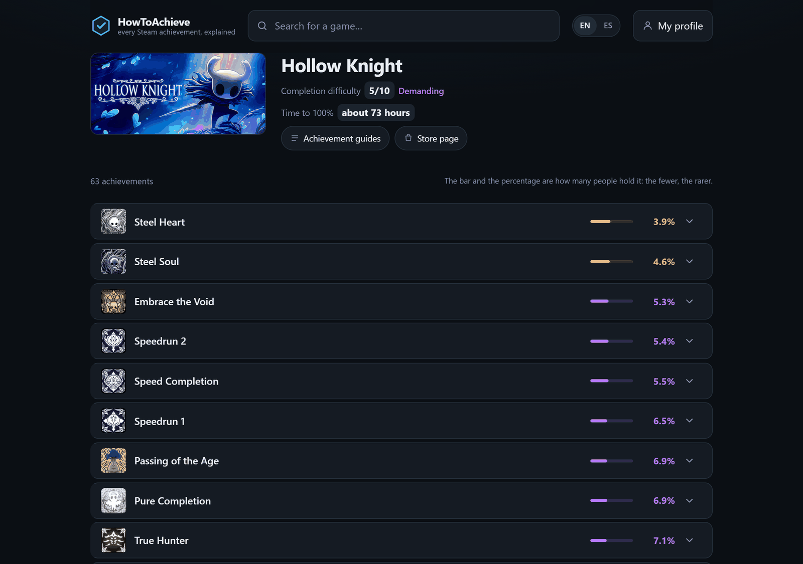
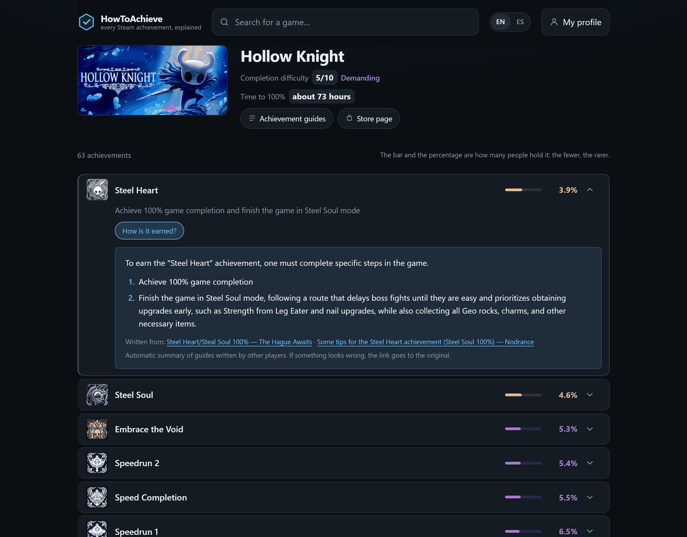

<div align="center">

# HowToAchieve &nbsp;·&nbsp; HistLow Tracker

**Two small Steam tools that each answer one question, and share nothing but this repository.**

*How is this achievement earned?* &nbsp;·&nbsp; *Has this game ever been cheaper?*

[](https://github.com/Isma-L154/histlow-tracker/actions/workflows/deploy-web.yml)
[](https://github.com/Isma-L154/histlow-tracker/actions/workflows/ci.yml)
[](LICENSE)

</div>

---

# HowToAchieve

**[howtoachieve.cloudils.com](https://howtoachieve.cloudils.com)** · lives in [`web/`](web/)

Steam tells you an achievement exists. It does not tell you how rare it really is, how
to get it, or what you are signing up for.

This does. Search a game and every achievement is listed **rarest first**, with the
global percentage that makes it rare. Open one and it explains, in steps, how people
actually earned it — summarised from the guides the community wrote, with links to the
originals.



### What it does

| | |
|---|---|
| **Ranked by true rarity** | Steam's global unlock percentage, rarest first. The bar and the figure are how many people hold it. |
| **How each one is earned** | Community guides for the game, read and summarised into steps. Sources are always linked; nothing is invented silently. |
| **Completion difficulty, 1–10** | Computed from the rarity distribution — how rare the rarest is, and how long the tail is. Calibrated against games people already agree about. |
| **Time to 100%** | From IGDB, when it knows. Optional: without the credentials the line is simply absent. |
| **What you are missing** | Paste a Steam profile and the list splits into what you hold and what is left. Nothing is stored. |
| **Most anticipated, counting down** | Release cards on the home page, ranked by IGDB hype, only ever showing dates IGDB marked exact. |
| **English content, interface in both** | The pages are English; the interface reads your browser and offers a switch. |





### How it works

```
Browser
   |
   |  /styles.css, /app.js, images,  -> served by Cloudflare's asset runtime.
   |  robots.txt, sitemap.xml           Worker code does not execute at all.
   |  everything else               -> the Worker
   v
Cloudflare Worker
   |
   |  1. Steam  SearchApps / appdetails            -> find the game
   |  2. Steam  GetSchemaForGame                   -> names, descriptions, icons
   |  3. Steam  GetGlobalAchievementPercentages    -> how rare each one is
   |  4. Steam  GetPlayerAchievements  (optional)  -> which ones you hold
   |  5. Steam  guide hub + guide pages            -> the guide corpus
   |  6. Workers AI                                -> those passages, as steps
   |  7. IGDB   (optional)                         -> time to 100%, release dates
   v
Cached at the edge, scoped to the deployment that produced it.
```

Every external call is cached and **degrades to absence, never to an error**: if IGDB is
down the time is missing and the page is otherwise untouched.

### Running it locally

```bash
cd web
npm ci
npx wrangler types      # generates worker-configuration.d.ts from wrangler.jsonc
npm run dev             # http://localhost:8787
```

`npm run dev` needs a Cloudflare login for the Workers AI binding, which has no local
simulator. Everything else works without one.

```bash
npm test                # 300+ tests, in workerd rather than Node
npx tsc --noEmit
```

The tests run inside the same runtime that serves the site, so nothing passes here by
being more forgiving than production. They need no credentials and reach no network.

### Configuration

**Secrets** — set with `wrangler secret put NAME` from `web/`, never committed:

| | |
|---|---|
| `STEAM_WEB_API_KEY` | Required. The Worker refuses to build a Steam client without one. [Get one here.](https://steamcommunity.com/dev/apikey) |
| `TWITCH_CLIENT_ID` | Optional. IGDB authenticates through Twitch. |
| `TWITCH_CLIENT_SECRET` | Optional, the other half of the pair. |

Register a Twitch application at [dev.twitch.tv/console/apps](https://dev.twitch.tv/console/apps)
with `http://localhost` as the redirect URL — it is free. Without the pair, completion
times and the release countdown are absent and nothing else changes. `/api/health`
reports which of the two features a deployment can serve.

**Everything non-secret** lives in [`wrangler.jsonc`](web/wrangler.jsonc), commented:
cache lifetimes, the model, how many guides form the corpus, the rate limits.

### Deployment

Pushing to `main` deploys `web/`. Never by hand — the workflow typechecks, deploys, and
then proves production is healthy, that the former address still redirects, and that
every page the Worker builds carries the site's security headers. A green deploy step
and a working site are not the same thing.

### Structure

```
web/
  src/                 The Worker
    index.ts           Routes, and the Worker's entrypoint. The runtime reads
                       every named export here as a handler or a binding, so
                       this file exports only its default handler and helpers
                       go in the siblings. A named export breaks the Worker at
                       startup, and `wrangler deploy --dry-run` does not catch
                       it.
    steam.ts           Steam Web API and the store, with timeouts and redaction
    guides.ts          Finding and reading community guides
    howto.ts           Turning guide passages into steps
    igdb.ts            Completion times and upcoming releases, via Twitch
    profile.ts         Working out what someone pasted into the profile box
    preview.ts         Per-game link previews. The only hand-built HTML here.
    art.ts             Which cover art a shared link should carry
    language.ts        Server-side translation, so there is no flash of English
    headers.ts         Copies the site's security policy onto Worker responses
    http.ts            Response helpers, and where log redaction lives
  public/              The page itself. No framework, no build step, served
                       exactly as written.
    app.js, nav.js     The client
    difficulty.js      The 1-10 score. Pure, and imported by both sides.
    i18n.js            The dictionary, likewise: the Worker translates the
                       first paint from it and the browser takes over after.
    _headers           The site's security policy, declared once
  test/                Vitest, in workerd
```

---

# HistLow Tracker

Lives in [`src/histlow/`](src/histlow/).

Watches a public Steam wishlist and raises an alert only when a game's sale **beats its
all-time low price on Steam** — a new record, not a return to an old one. Steam repeats a
title's deepest discount often, so a game can sit at its all-time low again and again
without ever going lower; those stay silent.

Runs as a GitHub Actions cron job. **Standard library only, on purpose** — no runtime
dependencies, no servers, no cost. Notifications land on iOS through the pre-installed
Shortcuts app, so there is no third-party app to install.

```
GitHub Actions (cron, once a day)
        |
        |  1. Steam  IWishlistService/GetWishlist    -> app ids
        |  2. Steam  appdetails (batched, 30/req)    -> current prices
        |             ^ keep only discounted titles
        |  3. ITAD   games/storelow/v2               -> all-time Steam low
        |             ^ keep current <= historical low
        |  4. ITAD   games/history/v2                -> did this sale set that low?
        |             ^ keep only new records
        |  5. State  suppress anything already alerted
        v
  Secret GitHub Gist (payload.json)
        ^
        |  polled on a schedule
  iOS Shortcuts automation -> a local notification with the title and price
```

Layering is one-directional: `domain` depends on nothing, adapters depend on `domain`,
`selector` is pure, and only `pipeline` wires them together.

### Running it locally

```bash
python -m venv .venv && . .venv/bin/activate   # .venv\Scriptsctivate on Windows
python -m pip install -e ".[dev]"              # the package, plus pytest and ruff

python -m pytest                               # unit tests, no network
python -m ruff check .
```

The editable install is not optional: `histlow` is a `src/` layout package, so
it is not importable without it, and `pytest` and `ruff` are extras rather than
dependencies.

To do a real run:

```bash
cp .env.example .env                      # then fill it in
python -m histlow --dry-run --force       # the full pipeline, publishing nothing
```

On Windows, set `PYTHONUTF8=1` first. [`docs/SETUP.md`](docs/SETUP.md) walks
through the whole thing end to end, including the iOS Shortcut and
[`scripts/bootstrap_gist.py`](scripts/bootstrap_gist.py), which creates the
secret gist that `GIST_ID` refers to.

### Configuration

Three places, and which is which matters.

**[`.env`](.env.example)** locally, GitHub Actions secrets in CI — never the
repository. Not all of it is secret; it is simply per-installation.

| | |
|---|---|
| `STEAM_ID64` | Your 17-digit id. Not a secret, but yours. The wishlist must be public, or Steam returns an empty payload with HTTP 200 and the run finds nothing. |
| `ITAD_API_KEY` | Secret. [isthereanydeal.com/apps/my](https://isthereanydeal.com/apps/my/) |
| `GIST_ID`, `GIST_TOKEN` | Secret. A gist as the payload drop; the token carries the `gist` scope and nothing else, so the only credential the workflow can leak is scoped to one gist by construction. |
| `STORE_COUNTRY` | **Change this.** The storefront you buy from, so prices are in the currency you will really pay. |
| `COMPARISON_COUNTRY` | **Probably change this.** ITAD has no price history for every currency Steam sells in — it reports Costa Rica and Mexico in USD — and comparing a colón price against a dollar low is meaningless. So the decision is made here and displayed in `STORE_COUNTRY`. `.env.example` explains when the two can be the same. |

**[`config.json`](config.json)** — behaviour, non-secret and safe to diff: what
counts as an alert, how long one is repeated, and the wording shown on the phone.

**[`.github/workflows/tracker.yml`](.github/workflows/tracker.yml)** — when it
runs. The cron lives there; `config.json`'s `min_interval_hours` only stops the
same work being done twice when a firing is duplicated or delayed.

### Structure

```
src/histlow/
  domain.py        Frozen dataclasses. No I/O.
  config.py        Environment and config.json, loaded and validated
  dotenv.py        Reading .env, byte order mark and all
  net.py           HTTP: timeouts, retries, backoff, redaction
  steam.py         Wishlist and batched store prices
  itad.py          App-id resolution cache and per-store historical lows
  cache.py         The app-id resolutions, kept between runs
  storage.py       Reading and writing the files under var/
  state.py         Alert de-duplication across runs
  selector.py      Pure decision logic: which deals qualify
  payload.py       The shape the phone reads
  publisher.py     Payload rendering and gist upload
  scheduling.py    Guard against doing the same work twice
  logging_setup.py Logging that never prints a secret at any level
  pipeline.py      Orchestration
tests/             Unit tests; no network access required
docs/SETUP.md      End-to-end setup, including the iOS Shortcut
scripts/           bootstrap_gist.py, which creates the payload gist
```

---

## Contributing

Every change starts as an issue and is closed by a pull request carrying `Closes #N`.
`main` is protected; CI is what makes merging your own work safe.

Write the failing test first, and check that it fails when you break the thing it guards
— a green test that never reaches the code path proves nothing. The rest, with the
measurements behind each decision, is in [`CLAUDE.md`](CLAUDE.md) and
[`docs/superpowers/specs/`](docs/superpowers/specs/).

## Licence

[MIT](LICENSE).

Achievement data, artwork and guide text belong to Steam and to the players who wrote
them. This project stores none of it: everything is fetched on demand, cached briefly at
the edge, and always attributed back to its source.
