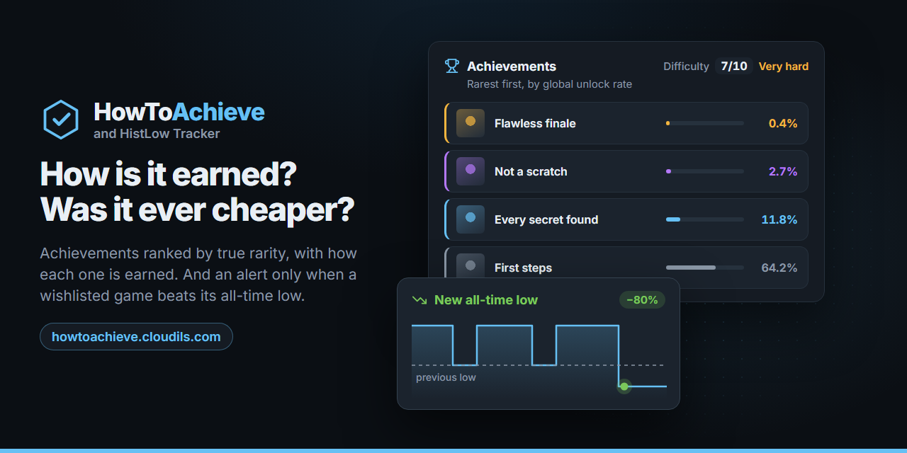
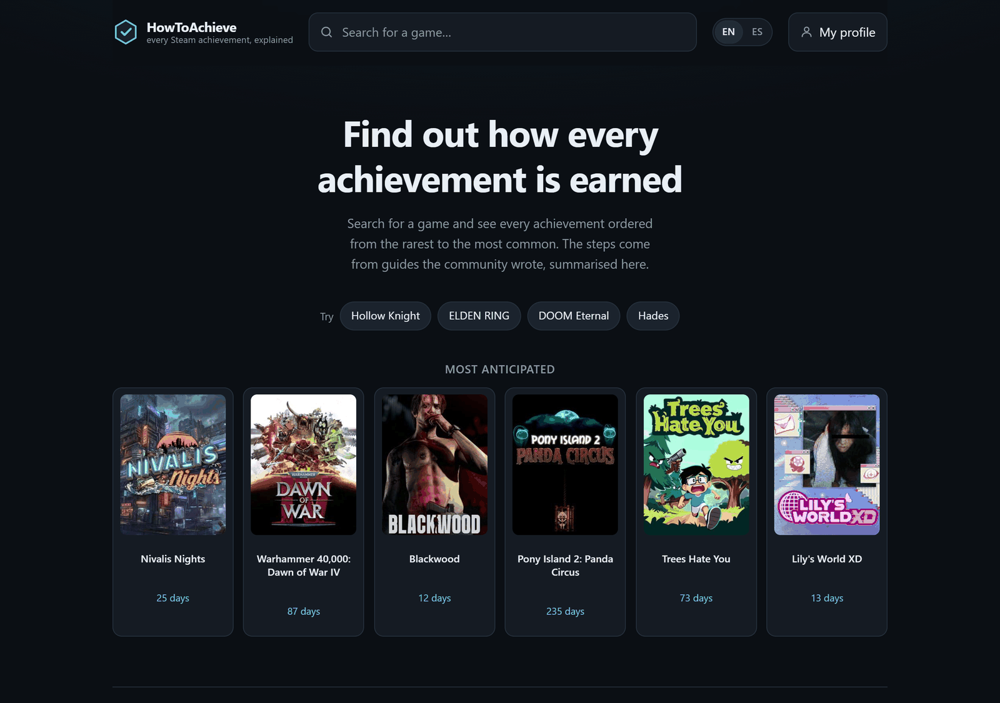
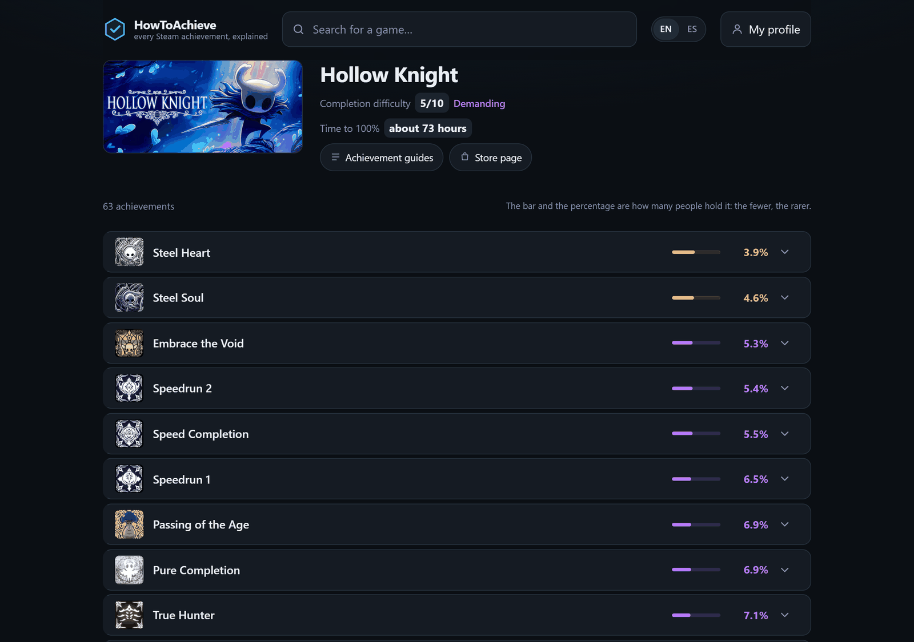
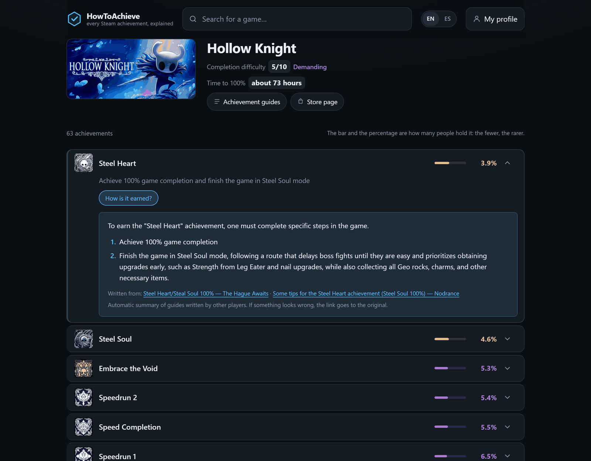
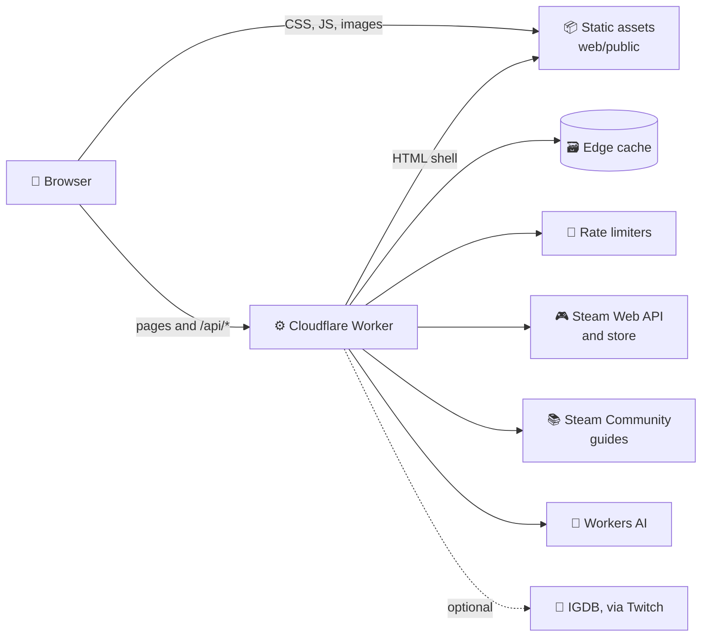
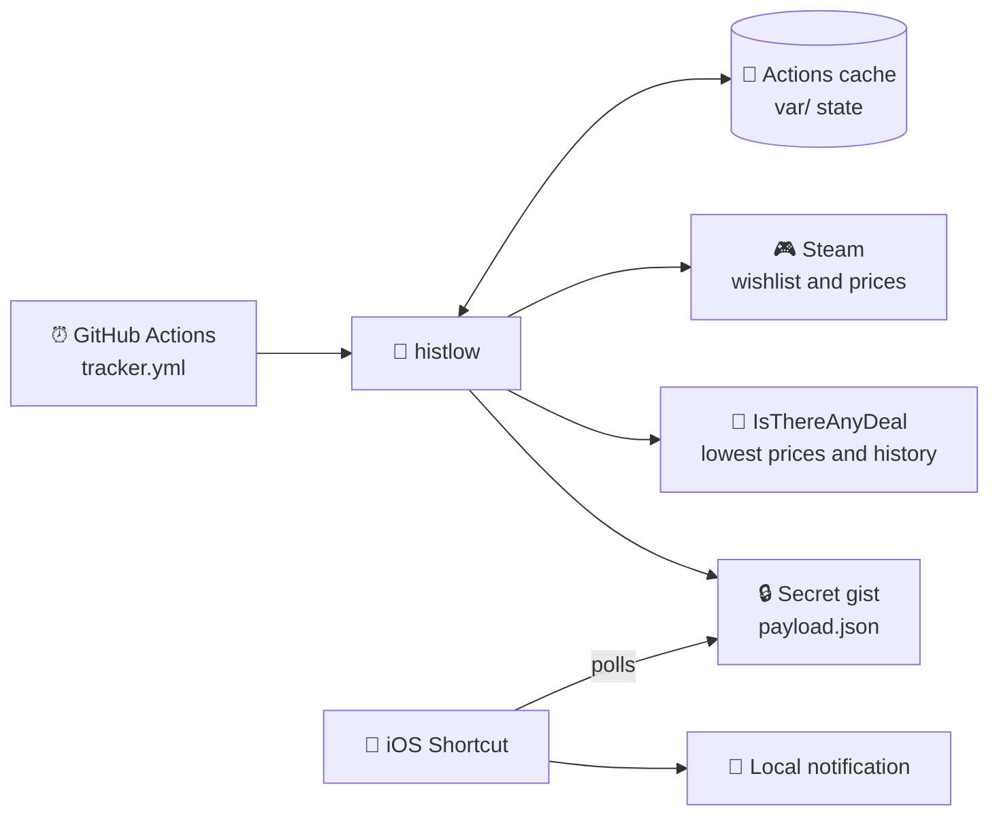

<p align="center">
  
</p>

<p align="center">
  <a href="https://github.com/Isma-L154/histlow-tracker/actions/workflows/ci.yml"></a>
  <a href="https://github.com/Isma-L154/histlow-tracker/actions/workflows/deploy-web.yml"></a>
  
  
  <a href="LICENSE"></a>
</p>

<p align="center">
  <b>Two small Steam tools that each answer one question, and share nothing but this repository.</b><br>
  HowToAchieve shows how every achievement in a game is earned, rarest first.<br>
  HistLow Tracker speaks up only when a wishlisted game beats its all-time low.
</p>

<p align="center">
  <a href="https://howtoachieve.cloudils.com">Live site</a> ·
  <a href="https://github.com/Isma-L154/histlow-tracker/issues">Report a bug</a> ·
  <a href="#running-locally">Run HowToAchieve locally</a> ·
  <a href="docs/SETUP.md">Set up the tracker</a>
</p>

---

# HowToAchieve

**[howtoachieve.cloudils.com](https://howtoachieve.cloudils.com)** · lives in [`web/`](web/)

Steam tells you an achievement exists. It does not tell you how rare it really is, how
to get it, or what you are signing up for.

This does. Search a game and every achievement is listed **rarest first**, with the
global percentage that makes it rare. Open one and it explains, in steps, how people
actually earned it — summarised from the guides the community wrote, with links to the
originals.



## What it does

- **Ranked by true rarity** — Steam's global unlock percentage, rarest first. The bar
  and the figure are how many players hold each one.
- **How each one is earned** — community guides for the game, read and summarised into
  steps, with every source linked. When the model's daily allowance is spent, the guide
  passages themselves are the answer.
- **Completion difficulty, 1–10** — computed from the rarity distribution: how rare the
  rarest is, and how long the tail is. Calibrated against games people already agree
  about.
- **Time to 100%** — from IGDB, when it knows. Without the IGDB credentials the line is
  simply absent.
- **What you are missing** — paste a Steam profile and the list splits into what you
  hold and what is left. That list is fetched fresh and never cached; your browser
  remembers the profile until you clear it.
- **Most anticipated, counting down** — release cards on the home page, ranked by IGDB
  hype, showing only dates IGDB marks as exact.
- **English content, interface in both** — the pages are English; the interface follows
  your browser's language from the first paint, and offers a switch.





## How it works


```mermaid
flowchart LR
    U["🧑 Browser"] -->|"CSS, JS, images"| A["📦 Static assets<br/>web/public"]
    U -->|"pages and /api/*"| W["⚙️ Cloudflare Worker"]
    W -->|"HTML shell"| A
    W --> C[("🗃️ Edge cache")]
    W --> R["🚦 Rate limiters"]
    W --> S["🎮 Steam Web API<br/>and store"]
    W --> G["📚 Steam Community<br/>guides"]
    W --> AI["🤖 Workers AI"]
    W -.->|"optional"| I["📅 IGDB, via Twitch"]
```

Static files never reach the Worker; every document does. That is what lets the Worker
translate the page before its first paint, give each game page its own link preview,
and redirect the former address, `cazalogros.cloudils.com`, with a 301.

Every external call is cached at the edge and **degrades to absence, never to an
error**: if IGDB is down the time is missing and the page is otherwise untouched. Cache
keys are built from a canonical path rather than the request URL, so a junk query
parameter cannot force a miss, and they are scoped to the deployment, so a publish
invalidates everything by construction.

`src/index.ts` exports only its default handler. The runtime reads every named export
there as a handler or a binding, so a named export breaks the Worker at startup — and
`wrangler deploy --dry-run` does not catch it. Helpers go in the sibling modules.

**Stack:** Cloudflare Workers · TypeScript · Workers AI · IGDB · plain HTML, CSS and
JavaScript, with no framework and no build step · Vitest in workerd

<details>
<summary>Where the code lives</summary>

```
web/
  src/                 The Worker
    index.ts           Routes, and the Worker's entrypoint (default export only)
    steam.ts           Steam Web API and the store, with timeouts and redaction
    guides.ts          Finding and reading community guides
    explain.ts         One achievement: its guide passages, then the steps
    howto.ts           Turning guide passages into steps
    igdb.ts            Completion times and upcoming releases, via Twitch
    profile.ts         Working out what someone pasted into the profile box
    pages.ts           The documents the Worker writes: the translated shell and
                       the per-game page
    preview.ts         Per-game link previews. The only hand-built HTML here.
    art.ts             Which cover art a shared link should carry
    language.ts        Server-side translation, so there is no flash of English
    edge-cache.ts      Cache keys, scoped to the deployment
    rate-limit.ts      Per-caller limits on the routes that spend a budget
    headers.ts         Copies the site's security policy onto Worker responses
    http.ts            Response helpers, and where log redaction lives
    env.d.ts           The secrets, which `wrangler types` cannot see
  public/              The page itself. No framework and no build step: static
                       files are served as written, and HTML documents pass
                       through the Worker first.
    app.js, nav.js     The client
    difficulty.js      The 1-10 score. Pure, and imported by both sides.
    i18n.js            The dictionary, likewise: the Worker translates the
                       first paint from it and the browser takes over after.
    _headers           The site's security policy, declared once
  test/                Vitest, in workerd
  design/og.svg        Source of the link-preview card, public/og.png
```

</details>

## Running locally

Needs Node.js 22 (what CI runs) and, for `npm run dev`, a Cloudflare login: the Workers
AI binding has no local simulator. The tests need neither a login nor a network.

```bash
cd web
npm ci
npx wrangler types   # generates worker-configuration.d.ts from wrangler.jsonc
# create web/.dev.vars holding the variables below, one NAME=value per line
npm run dev          # http://localhost:8787
```

| Variable | Description |
| -------- | ----------- |
| `STEAM_WEB_API_KEY` | Required. A Steam Web API key, from [steamcommunity.com/dev/apikey](https://steamcommunity.com/dev/apikey). Without it every Steam route answers 503. |
| `TWITCH_CLIENT_ID` | Optional. IGDB signs in through Twitch: register an application at [dev.twitch.tv/console/apps](https://dev.twitch.tv/console/apps) with `http://localhost` as the redirect URL. It is free. |
| `TWITCH_CLIENT_SECRET` | Optional, the other half of that pair. Without both, completion times and the release countdown are absent and nothing else changes. |

> ⚠️ `.dev.vars` is git-ignored and must never be committed. In production the same
> names are Worker secrets; see [Deployment](#deployment).

Everything non-secret lives in [`web/wrangler.jsonc`](web/wrangler.jsonc), commented:
cache lifetimes, how many guides form the corpus, the model, the rate limits, and an
optional `DEFAULT_STEAM_ID`.

```bash
npm test             # the suite, inside workerd rather than Node
npx tsc --noEmit     # typecheck
npm run check        # binding types, typecheck and a deploy dry run
```

The tests run inside the same runtime that serves the site, so nothing passes here by
being more forgiving than production. Steam is stubbed, and no binding reaches the
account.

The README banner is drawn in [`docs/brand/banner.html`](docs/brand/banner.html), in
the site's own colours. Regenerate it from the repository root with
`npx -y playwright@1.63.0 screenshot --viewport-size "1280,640" "file:///<absolute path>/docs/brand/banner.html" docs/brand/banner.png`.

## Deployment

Pushing to `main` deploys `web/` through
[`deploy-web.yml`](.github/workflows/deploy-web.yml), whenever `web/` or the workflow
itself changed. Never by hand. The workflow typechecks and deploys, then proves
production: `/api/health` answers, every page the Worker builds carries the same
security headers as the static files, `HEAD` answers like `GET`, and the former address
still redirects. A green deploy step and a working site are not the same thing.

Repository secrets:

- `CLOUDFLARE_API_TOKEN` — a Cloudflare API token allowed to deploy this Worker.
- `CLOUDFLARE_ACCOUNT_ID` — optional, only when the token reaches more than one account.

First time only, set the Worker's own secrets from `web/`, one prompt each:

```bash
npx wrangler secret put STEAM_WEB_API_KEY
npx wrangler secret put TWITCH_CLIENT_ID       # optional
npx wrangler secret put TWITCH_CLIENT_SECRET   # optional
```

The custom domains in `wrangler.jsonc` are created by Cloudflare itself, DNS record
and certificate included. `/api/health` reports which of the IGDB features a deployment
can serve.

## Security

- **Secrets stay on the server.** The Steam key and the Twitch pair are Worker secrets,
  never in the repository or the browser. `logFailure` redacts every query value not on
  an allowlist, so a new upstream's credential is hidden by default.
- **Every input is bounded before it goes upstream.** App ids are at most 10 digits,
  achievement keys at most 120 characters from a fixed class, searches at most 100
  characters; anything outside those bounds is refused before Steam is called.
- **Rate limits on the routes that spend a budget**, per caller by IP since the site
  has no accounts: 20 a minute for how-to answers, 10 for profile lookups, completion
  times and personal achievement lists. The how-to route also keeps a per-isolate
  allowance, because the platform limiter never refused a request when measured.
- **Escaped output.** Link previews, the only HTML built by hand, escape every value
  that came from Steam, and translations are escaped as they are written into the shell.
- **A strict Content Security Policy** in [`web/public/_headers`](web/public/_headers):
  `default-src 'none'`, `object-src 'none'`, `base-uri 'none'`, `frame-ancestors 'none'`,
  plus HSTS with preload, `nosniff` and `Referrer-Policy: no-referrer`. `headers.ts`
  copies it onto the responses the Worker builds, and every deploy checks production
  for it.
- **Same-origin only.** The API sends no `Access-Control-*` headers.
- **No database, so no user rows to protect.** The edge cache holds only answers that
  are the same for everyone; a personal achievement list bypasses it.

---

# HistLow Tracker

Lives in [`src/histlow/`](src/histlow/).

Watches a public Steam wishlist and raises an alert only when a game's sale **beats its
all-time low price on Steam** — a new record, not a return to an old one. Steam repeats a
title's deepest discount often, so a game can sit at its all-time low again and again
without ever going lower; those stay silent.

## What it does

- **Alerts on a new record only** — a sale has to beat every earlier Steam price, not
  match it. Set `alerts.require_new_record` to `false` in `config.json` to hear about
  returns to the old low too.
- **Prices in your own currency** — shown in the storefront you buy from, while the
  decision is made in a region IsThereAnyDeal tracks.
- **One notification per deal** — the payload carries an `alert_id`, and the Shortcut
  remembers the last one it showed, however often it polls.
- **No app to install** — notifications come from the Shortcuts app that ships with
  iOS, reading a secret gist.
- **Runs itself** — a GitHub Actions cron that fires twice a day, so an afternoon sale
  does not wait for the next morning.
- **Standard library only, on purpose** — no runtime dependencies, which CI proves by
  importing every module on a bare interpreter.

## How it works


```mermaid
flowchart LR
    T["⏰ GitHub Actions<br/>tracker.yml"] --> H["🐍 histlow"]
    H <--> V[("💾 Actions cache<br/>var/ state")]
    H --> S["🎮 Steam<br/>wishlist and prices"]
    H --> D["💸 IsThereAnyDeal<br/>lowest prices and history"]
    H --> G["🔒 Secret gist<br/>payload.json"]
    P["📱 iOS Shortcut"] -->|"polls"| G
    P --> N["🔔 Local notification"]
```

Each run narrows the wishlist step by step:

1. Steam `IWishlistService/GetWishlist` → app ids.
2. Steam `appdetails`, 30 per request → current prices; keep the discounted titles.
3. ITAD `games/lookup/v1` → ITAD ids, kept in `var/` between runs.
4. ITAD `games/storelow/v2` → the all-time Steam low; keep current ≤ low.
5. ITAD `games/history/v2` → did this sale set that low? Keep only new records.
6. State → suppress anything already alerted, then publish the payload to the gist.

Layering is one-directional: `domain` depends on nothing, adapters depend on `domain`,
`selector` is pure, and only `pipeline` wires them together. Runs are queued rather
than overlapped, because two at once would race on the state and could alert twice.

**Stack:** Python 3.11+, standard library only · GitHub Actions · IsThereAnyDeal API ·
GitHub Gists · iOS Shortcuts

<details>
<summary>Where the code lives</summary>

```
src/histlow/
  domain.py        Frozen dataclasses. No I/O.
  config.py        Environment and config.json, loaded and validated
  dotenv.py        Reading .env, byte order mark and all
  net.py           HTTP: timeouts, retries, backoff, redaction
  steam.py         Wishlist and batched store prices
  itad.py          App-id resolution and per-store historical lows
  cache.py         The app-id resolutions, kept between runs
  storage.py       Reading and writing the files under var/
  state.py         Alert de-duplication across runs
  selector.py      Pure decision logic: which deals qualify
  payload.py       The shape the phone reads
  publisher.py     Payload rendering and gist upload
  scheduling.py    Guard against doing the same work twice
  logging_setup.py Logging that never prints a secret at any level
  pipeline.py      Orchestration
tests/             Unit tests; no network access required
docs/SETUP.md      End-to-end setup, including the iOS Shortcut
scripts/           bootstrap_gist.py, which creates the payload gist
```

</details>

## Running locally

Needs Python 3.11 or newer. CI tests 3.11 and 3.12; the cron runs 3.12.

```bash
python -m venv .venv && . .venv/bin/activate   # .venv\Scripts\activate on Windows
python -m pip install -e ".[dev]"              # the package, plus pytest and ruff

python -m pytest                               # unit tests, no network
python -m ruff check .
```

The editable install is not optional: `histlow` is a `src/` layout package, so it is
not importable without it, and `pytest` and `ruff` are extras rather than dependencies.

To do a real run:

```bash
cp .env.example .env                  # then fill it in
python -m histlow --dry-run --force   # the full pipeline, publishing nothing
```

[`docs/SETUP.md`](docs/SETUP.md) walks through the whole thing end to end, including
the iOS Shortcut and [`scripts/bootstrap_gist.py`](scripts/bootstrap_gist.py), which
creates the secret gist that `GIST_ID` refers to.

Settings live in three places, and which is which matters.

**[`.env`](.env.example)** — per installation, and not all of it is secret:

| Variable | Description |
| -------- | ----------- |
| `STEAM_ID64` | Required. Your 17-digit id, from [steamid.io](https://steamid.io). The wishlist must be public, or Steam returns an empty payload with HTTP 200. |
| `ITAD_API_KEY` | Required. The **API key** of an application registered at [isthereanydeal.com/apps/my](https://isthereanydeal.com/apps/my/); the OAuth values do not work here. |
| `GIST_ID` | The secret gist the payload is published to, created by `scripts/bootstrap_gist.py`. |
| `GIST_TOKEN` | A GitHub token carrying the `gist` scope and nothing else, so the only credential the workflow can leak is bounded to gists. |
| `STORE_COUNTRY` | **Change this.** The storefront you buy from, as a 2-letter code, so prices are in the currency you will really pay. |
| `COMPARISON_COUNTRY` | **Probably change this.** ITAD has no price history for every currency Steam sells in — it reports Costa Rica and Mexico in USD — so the decision is made here and displayed in `STORE_COUNTRY`. Defaults to `US`; `.env.example` explains when the two can be the same. |
| `LOG_LEVEL` | Optional. `INFO` by default, `DEBUG` for per-app detail. Secrets are masked at every level. |
| `DRY_RUN` | Optional. `true` runs everything but publishes nothing, like `--dry-run`. |

> ⚠️ `.env` is git-ignored and must never be committed.

**[`config.json`](config.json)** — behaviour, non-secret and safe to diff: what counts
as an alert, how long one is repeated, and the wording shown on the phone.

**[`.github/workflows/tracker.yml`](.github/workflows/tracker.yml)** — when it runs. The
cron lives there; `config.json`'s `min_interval_hours` only stops the same work being
done twice when a firing is duplicated or delayed.

## Deployment

There is nothing to host. [`tracker.yml`](.github/workflows/tracker.yml) runs the
tracker on GitHub Actions and keeps its state in the Actions cache.

- Repository secrets: `STEAM_ID64`, `ITAD_API_KEY`, `GIST_ID`, `GIST_TOKEN`.
- Repository variables, optional: `STORE_COUNTRY` (default `CR`) and
  `COMPARISON_COUNTRY` (default `US`). They must be variables: a secret by either name
  is ignored.

First time: create the gist, set the values above, run the workflow once by hand
(**Actions → tracker → Run workflow**) and build the iOS Shortcut —
[`docs/SETUP.md`](docs/SETUP.md) covers each step. In a fork the cron is skipped by an
owner check in `tracker.yml`; a manual run is not.

GitHub disables scheduled workflows after 60 days without a commit, and the tracker
never commits. [`keepalive.yml`](.github/workflows/keepalive.yml) commits a timestamp
once the repository has been quiet for 45 days, and only then.

## Security

- **Secrets only in the environment** — `.env` locally, Actions secrets in CI. The
  loaded secrets seed a logging filter that masks them at every level, and a malformed
  `STEAM_ID64` is reported by its length, never its value.
- **A token that can only touch gists** — `GIST_TOKEN` carries the `gist` scope alone.
- **Least-privilege workflows** — every workflow declares its `permissions`; the
  tracker can only read the repository, and `keepalive.yml`, the one that can write,
  holds no secrets. Actions are pinned by commit SHA and kept current by Dependabot.
- **Configuration is validated before any request** — country codes, the Steam id and
  every `config.json` section are checked at startup, and a bad value stops the run
  with exit code 1.
- **No third-party runtime code** — standard library only, checked in CI.
- **No server surface** — the tracker answers no requests, so CORS, rate limiting,
  row-level security and a Content Security Policy have nothing to apply to.

---

## Contributing

Every change starts as an issue and is closed by a pull request carrying `Closes #N`.
`main` is protected; CI is what makes merging your own work safe.

Write the failing test first, and check that it fails when you break the thing it guards
— a green test that never reaches the code path proves nothing. The rest, with the
measurements behind each decision, is in [`AGENTS.md`](AGENTS.md) and
[`docs/superpowers/specs/`](docs/superpowers/specs/).

## Licence

[MIT](LICENSE).

Achievement data, artwork and guide text belong to Steam and to the players who wrote
them. This project stores none of it: everything is fetched on demand, cached briefly at
the edge, and always attributed back to its source.

The banner embeds the Inter typeface, © The Inter Project Authors, under the
[SIL Open Font License 1.1](docs/brand/Inter-OFL.txt).
